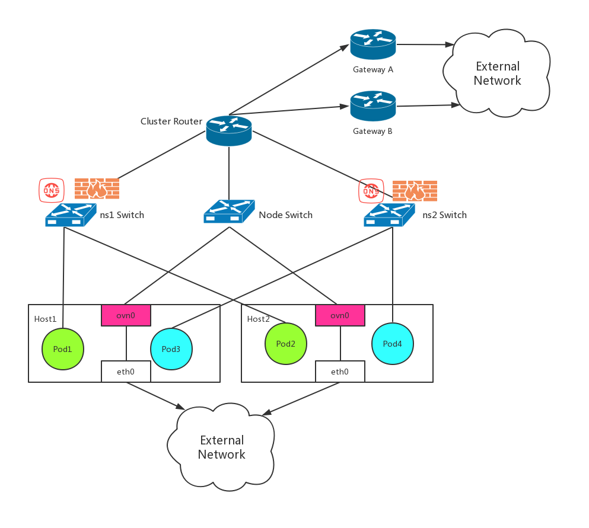

[](https://kube-ovn.io/)
[](https://github.com/kubeovn/kube-ovn/blob/master/LICENSE)
[](https://github.com/kubeovn/kube-ovn/releases)
[](https://img.shields.io/docker/pulls/kubeovn/kube-ovn)

[](https://goreportcard.com/report/github.com/kubeovn/kube-ovn)

Kube-OVN, a [CNCF Sandbox Project](https://www.cncf.io/sandbox-projects/), integrates OVN-based Network Virtualization with Kubernetes. It provides enhanced support for KubeVirt and unique Multi-Tenancy capabilities.

## Network Topology



## Features

- **VPC Support**: Multi-tenant network with independent address spaces, where each tenant has its own network infrastructure such as eips, nat gateways, security groups and loadbalancers.
- **Namespaced Subnets**: Each Namespace can have a unique Subnet (backed by a Logical Switch). Pods within the Namespace will have IP addresses allocated from the Subnet. It's also possible for multiple Namespaces to share a Subnet.
- **Vlan/Underlay Support**: In addition to overlay network, Kube-OVN also supports underlay and vlan mode network for better performance and direct connectivity with physical network.
- **Static IP Addresses for Workloads**: Allocate random or static IP addresses to workloads.
- **Seamless VM LiveMigration**: Live migrate KubeVirt vm without network interruption.
- **Non-Primary CNI Mode**: Kube-OVN can work as a secondary CNI alongside other primary CNIs (Cilium, Calico, etc.), providing additional network interfaces and advanced networking features via Network Attachment Definitions (NADs).
- **Multi-Cluster Network**: Connect different Kubernetes/Openstack clusters into one L3 network.
- **TroubleShooting Tools**: Handy tools to diagnose, trace, monitor and dump container network traffic to help troubleshoot complicate network issues.
- **Prometheus & Grafana Integration**: Exposing network quality metrics like pod/node/service/dns connectivity/latency in Prometheus format.
- **ARM Support**: Kube-OVN can run on x86_64 and arm64 platforms.
- **Subnet Isolation**: Can configure a Subnet to deny any traffic from source IP addresses not within the same Subnet. Can whitelist specific IP addresses and IP ranges.
- **Network Policy**: Implementing networking.k8s.io/NetworkPolicy API by high performance ovn ACL.
- **DualStack IP Support**: Pod can run in IPv4-Only/IPv6-Only/DualStack mode.
- **Pod NAT and EIP**: Manage the pod external traffic and external ip like tradition VM.
- **IPAM for Multi NIC**: A cluster-wide IPAM for CNI plugins other than Kube-OVN, such as macvlan/vlan/host-device to take advantage of subnet and static ip allocation functions in Kube-OVN.
- **Dynamic QoS**: Configure Pod/Gateway Ingress/Egress traffic rate/priority/loss/latency on the fly.
- **Embedded Load Balancers**: Replace kube-proxy with the OVN embedded high performance distributed L2 Load Balancer.
- **Distributed Gateways**: Every Node can act as a Gateway to provide external network connectivity.
- **Namespaced Gateways**: Every Namespace can have a dedicated Gateway for Egress traffic.
- **Direct External Connectivity**: Pod IP can be exposed to external network directly.
- **BGP Support**: Pod/Subnet IP can be exposed to external by BGP router protocol.
- **Traffic Mirror**: Duplicated container network traffic for monitoring, diagnosing and replay.
- **Hardware Offload**: Boost network performance and save CPU resource by offloading OVS flow table to hardware.

## Quick Start

Kube-OVN is easy to install, please refer to the [Installation Guide](https://kubeovn.github.io/docs/stable/en/start/one-step-install/).

## Documents

### Runtime images for offline installations

GitHub releases include `images-amd64.txt` and `images-arm64.txt`: sorted,
deduplicated runtime image references for mirroring. Both include NAT gateways
and optional chart components; only AMD64 includes the DPDK image. Build-time
base images are excluded. The references use multi-platform tags where available;
select `linux/amd64` or `linux/arm64` in your mirroring tool as appropriate.

To generate a list from a release checkout, install Helm 3 or newer and Python 3
with PyYAML, then run:

```sh
make image-list > images-amd64.txt
make image-list IMAGE_LIST_ARGS='--arch arm64' > images-arm64.txt
```

The generator renders the Helm v2 chart with optional image-producing components
enabled. Release tags default to `VERSION`; use `--version v1.x.y` to override.
Custom Helm v2 image settings are supported through `--values` and
`--set-string`, and take precedence over the release tag defaults:

```sh
make image-list IMAGE_LIST_ARGS='--arch amd64 --values mirror-values.yaml'
```

These lists cover images configured by Kube-OVN, including the NAT BGP sidecar.
Separately installed dependencies such as Multus and cert-manager, and application
images, must be mirrored separately. To generate a historical release's inventory,
use that release's chart and generator rather than changing only `--version` on
a newer checkout.

### Guides

- [CNI Selection Recommendations](https://kubeovn.github.io/docs/stable/en/#cni-selection-recommendations)
- [Getting Start](https://kubeovn.github.io/docs/stable/en/start/prepare/)
- [KubeVirt Usage](https://kubeovn.github.io/docs/stable/en/kubevirt/static-ip/)
- [VPC Network](https://kubeovn.github.io/docs/stable/en/vpc/vpc/)
- [User Guide](https://kubeovn.github.io/docs/stable/en/guide/setup-options/)
- [Operations](https://kubeovn.github.io/docs/stable/en/ops/kubectl-ko/)
- [Advanced Usage](https://kubeovn.github.io/docs/stable/en/advance/multi-nic/)
- [Reference](https://kubeovn.github.io/docs/stable/en/reference/architecture/)

## Contribution

We are looking forward to your PR!

- [Development Guide](https://kubeovn.github.io/docs/en/reference/dev-env/)
- [Architecture Guide](https://kubeovn.github.io/docs/en/reference/architecture/)

## Community

The Kube-OVN community is waiting for your participation!

- 🔗 Follow us on [Linkedin](https://www.linkedin.com/company/kube-ovn/)
- 💬 Chat with us on [Slack](https://cloud-native.slack.com/archives/C0AQMHUDX39)

## Adopters

A list of adopters and use cases can be found in [USERS.md](USERS.md)
