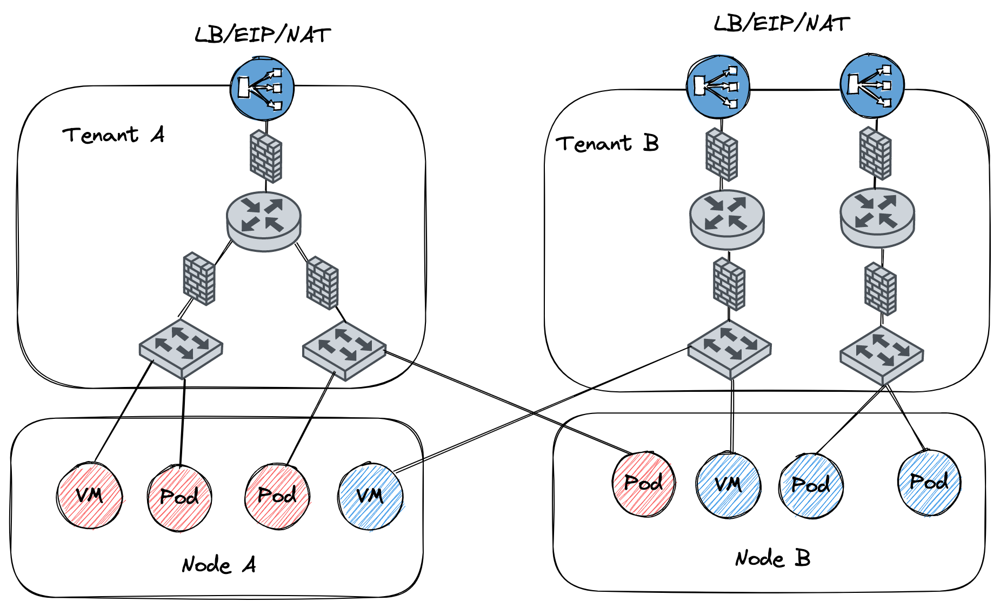

# Kube-OVN

Kube-OVN integrates the OVN-based Network Virtualization with Kubernetes. It offers an advanced Container Network Fabric for Enterprises.

## Features
- **Namespaced Subnets**: Each Namespace can have a unique Subnet (backed by a Logical Switch). Pods within the Namespace will have IP addresses allocated from the Subnet. It's also possible for multiple Namespaces to share a Subnet.
- **Subnet Isolation**: Can configure a Subnet to deny any traffic from source IP addresses not within the same Subnet. Can whitelist specific IP addresses and IP ranges.
- **Network Policy**: Kube-OVN implements networking.k8s.io/NetworkPolicy API by ovn ACL.
- **Static IP Addresses for Workloads**: Allocate random or static IP addresses to workloads.
- **Dynamic QoS**: Configure Pod Ingress/Egress traffic rate limits on the fly.
- **Embedded Load Balancers**: Replace kube-proxy with the OVN embedded distributed L2 Load Balancer.
- **Distributed Gateways**: Every Node can act as a Gateway to provide external network connectivity.
- **Namespaced Gateways**: Every Namespace can have a dedicated Gateway for Egress traffic.
- **Direct External Connectivity**：Pod IP can be exposed to external network directly.

## Planned Future Work
- Hardware Offloading and DPDK Support
- Policy-based QoS
- More Metrics and Traffic Graph
- More Diagnosis and Tracing Tools

## Network Topology

The Switch, Router, Firewall showed in the diagram below are all distributed on all Nodes. There is no single point of failure for in cluster network.

## Quick Start
Kube-OVN is easy to install with all necessary components/dependencies included. Please refer to the [Installation Guide](docs/install.md).

## Documents
- [Namespaced Subnets](docs/subnet.md)
- [Subnet Isolation](docs/isolation.md)
- [Static IP](docs/static-ip.md)
- [Dynamic QoS](docs/qos.md)
- [Gateway and Direct connect](docs/gateway.md)

## Contact
Mail: mengxin#alauda.io

WeChat: liumengxinfly
