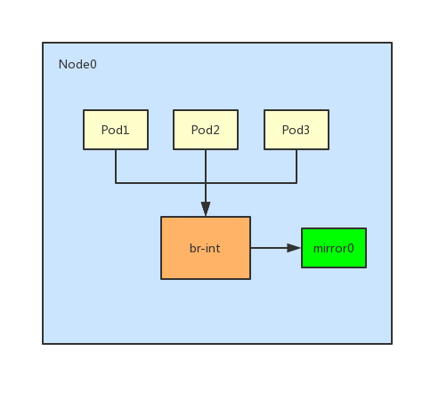

# Traffic Mirror

Kube-OVN support traffic mirroring that duplicates pod nic send/receive network packets to a dedicated host nic. Administrator or developer can then use it to monitor network traffic or diagnose network problems.



## Enable Traffic Mirror

Traffic mirror is disabled by default, you should add cmd args in cni-server when installing kube-ovn to enabled it.
- `--enable-mirror=true`: enable traffic mirror
- `--mirror-iface=mirror0`: kube-ovn will create an ovs internal port on every node to mirror pod traffic on that node. If not set will use mirror0 as the default port name

Then you can use tcpdump or other tools to diagnose traffic from interface mirror0:

```bash
tcpdump -ni mirror0
```