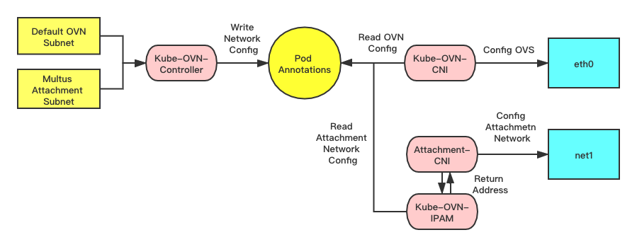

# IPAM for Multi Network Interface

From version 1.1, the IPAM part of Kube-OVN can provides subnet and static ip allocation functions to other CNI plugins, such as macvlan/vlan/host-device.

## How it works

By using [Intel Multus CNI](https://github.com/intel/multus-cni), we can attach multiple network interfaces into a Kubernetes Pod.
However, we still need some cluster-wide IPAM utilities to manage IP addresses for multi network to better mange other CNI plugins.
In Kube-OVN we already has CRDs like Subnet and IP and functions for advanced IPAM like ip reservation, random allocation, static allocation and so on.
We extend the Subnet to network providers other than ovn, so other CNI plugins can take use all the IPAM functions already exist in Kube-OVN.

### Work Flow

The diagram below shows how Kube-OVN allocate address for other CNI plugins. The default ovn eth0 network still goes the same way as before.
The net1 network comes from the NetworkAttachmentDefinition defined by multus-cni.
When a new pod appears, the kube-ovn-controller will read the pod annotations and find an available address then write it to the pod annotations.
Then on the CNI side, the attached CNI plugins can chain kube-ovn-ipam as the ipam plugin, which will read the pod annotations above and return the allocated address to the attached CNI plugins.

### Limitation
Kube-OVN now uses ovn network as the pod default network, other network can only act as network attachments.
We will fully separate the IPAM functions to provide a more general IPAM later.



## How to use it

### Install Kube-OVN and Multus-CNI

Please refer to [Kube-OVN installation](install.md) and [Multus how to use](https://github.com/intel/multus-cni/blob/master/doc/how-to-use.md) to install Kube-OVN and Multus-CNI.

### Create network attachment definition

We use macvlan as the second container network and chain it with kube-ovn ipam.
```bash
apiVersion: "k8s.cni.cncf.io/v1"
kind: NetworkAttachmentDefinition
metadata:
  name: macvlan
  namespace: default
spec:
  config: '{
      "cniVersion": "0.3.0",
      "type": "macvlan",
      "master": "eth0",
      "mode": "bridge",
      "ipam": {
        "type": "kube-ovn",
        "server_socket": "/run/openvswitch/kube-ovn-daemon.sock",
        "provider": "macvlan.default"
      }
    }'
```
`type`: Should be `kube-ovn` to invoke Kube-OVN plugin to fetch the address

`server_socket`: Is the socket file that Kube-OVN plugin communicate with. Default location is `/run/openvswitch/kube-ovn-daemon.sock`

`provider`: The `<namespace>.<name>` of this NetworkAttachmentDefinition, Kube-OVN plugin will later use it to find the related subnet.

### Create a Kube-OVN subnet

Create a Kube-OVN Subnet, set the desired cidr, exclude ips and the `provider` should be the related NetworkAttachmentDefinition
```bash
apiVersion: kubeovn.io/v1
kind: Subnet
metadata:
  name: macvlan
spec:
  protocol: IPv4
  provider: macvlan.default
  cidrBlock: 172.17.0.0/16
  gateway: 172.17.0.1
  excludeIps:
  - 172.17.0.0..172.17.0.10
```
Other options like gateway, private, nat are not available for attachment network.

### Create pod with multi network

For random allocation, just add the `k8s.v1.cni.cncf.io/networks`:

```bash
apiVersion: v1
kind: Pod
metadata:
  name: samplepod
  namespace: default
  annotations:
    k8s.v1.cni.cncf.io/networks: macvlan
spec:
  containers:
  - name: samplepod
    command: ["/bin/ash", "-c", "trap : TERM INT; sleep infinity & wait"]
    image: alpine

```

### Create Pod with static IP

For static allocation, add the `<networkAttachmentName>.<networkAttachmentNamespace>.kubernetes.io/ip_address` annotations:

```bash
apiVersion: v1
kind: Pod
metadata:
  name: static-ip
  namespace: default
  annotations:
    k8s.v1.cni.cncf.io/networks: macvlan
    ovn.kubernetes.io/ip_address: 10.16.0.15
    ovn.kubernetes.io/mac_address: 00:00:00:53:6B:B6
    macvlan.default.kubernetes.io/ip_address: 172.17.0.100
    macvlan.default.kubernetes.io/mac_address: 00:00:00:53:6B:BB
spec:
  containers:
  - name: static-ip
    image: nginx:alpine
```

### Create Workload with static IP

For workload need ippool allocation, add the `<networkAttachmentName>.<networkAttachmentNamespace>.kubernetes.io/ip_pool` annotations:

```bash
apiVersion: apps/v1
kind: Deployment
metadata:
  namespace: default
  name: static-workload
  labels:
    app: static-workload
spec:
  replicas: 2
  selector:
    matchLabels:
      app: static-workload
  template:
    metadata:
      labels:
        app: static-workload
      annotations:
        k8s.v1.cni.cncf.io/networks: macvlan
        ovn.kubernetes.io/ip_pool: 10.16.0.15,10.16.0.16,10.16.0.17
        macvlan.default.kubernetes.io/ip_pool: 172.17.0.200,172.17.0.201,172.17.0.202
    spec:
      containers:
      - name: static-workload
        image: nginx:alpine
```
