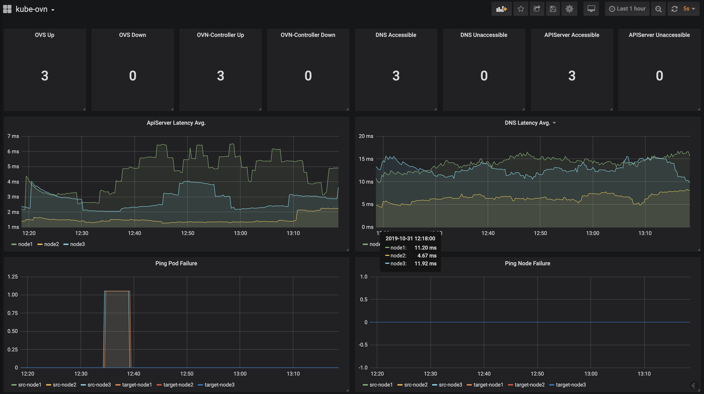

Pinger makes network requests between pods/nodes/services/dns to test the connectivity in the cluster and expose metrics in Prometheus format.

## Prometheus Integration

Pinger exposes metrics at `:8080/metrics`, it will show following metrics

```bash
pinger_ovs_up
pinger_ovs_down
pinger_ovn_controller_up
pinger_ovn_controller_down
pinger_dns_healthy
pinger_dns_unhealthy
pinger_dns_latency_ms
pinger_pod_ping_latency_ms
pinger_pod_ping_lost_total
pinger_node_ping_latency_ms
pinger_node_ping_lost_total
```

## Grafana Dashboard

Grafana Dashboard config can be found [here](grafana.json).




