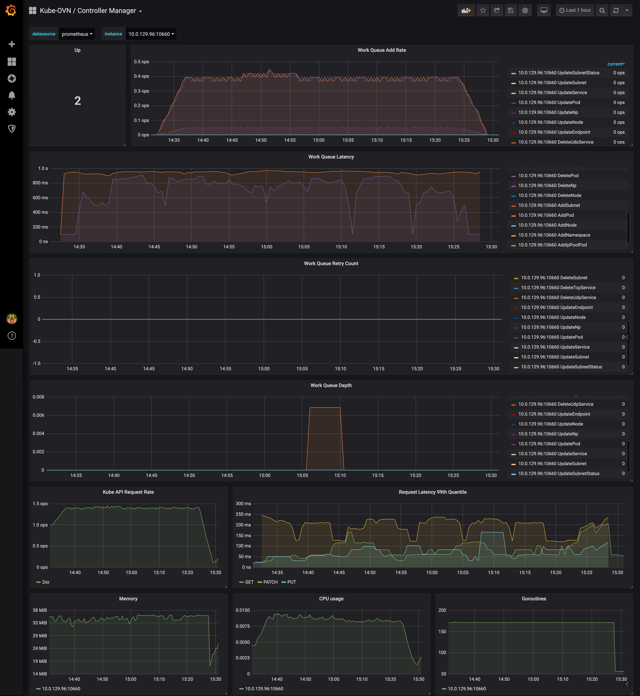
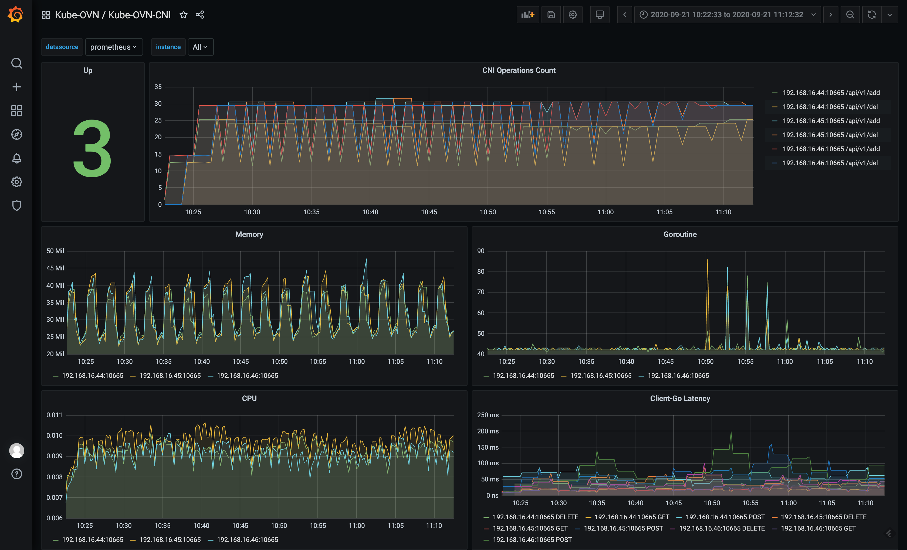

Pinger makes network requests between pods/nodes/services/dns to test the connectivity in the cluster and expose metrics in Prometheus format.

## Prometheus Integration

Kube-OVN will expose metrics of its own components and network quality. All exposed metrics can be found [here](ovn-ovs-monitor.md).

You can use kube-prometheus to scrape the metrics. The related ServiceMonitor yaml can be found [here](../dist/monitoring).

## Grafana Dashboard

Pinger grafana dashboard config can be found [here](../dist/monitoring/pinger-grafana.json).

Kube-OVN-Controller grafana dashboard config can be found [here](../dist/monitoring/controller-grafana.json)

Kube-OVN-CNI grafana dashboard config can be found [here](../dist/monitoring/cni-grafana.json)

