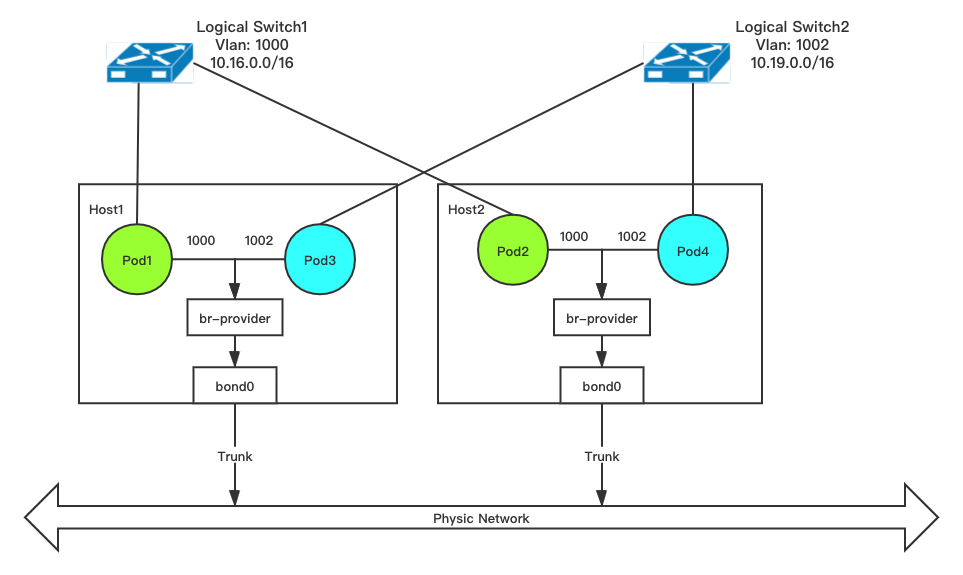

## Vlan/Underlay Support

By default, Kube-OVN use Geneve to encapsulate packets between hosts, which will build an overlay network above your infrastructure.
Kube-OVN also support underlay Vlan mode network for better performance and throughput.
In Vlan mode, the packets will send directly to physical switches with vlan tags.

To enable Vlan mode, a ~~dedicated~~ network interface is required by container network. Mac address, MTU, IP addresses and routes attached to the interface will be copied/transferred to an OVS bridge named `br-provider`.
The related switch port must work in trunk mode to accept 802.1q packets. For underlay network with no vlan tag, you need
to set the VLAN ID to 0.

~~By now, Geneve or Vlan network mode is a global install option, all container must work in the same network mode.
We are working at combine two networks in one cluster.~~

We introduce a new hybrid mode that allows Geneve and Vlan to exist at the same time.
You can have a subnet A using Geneve encapsulation and subnet B using Vlan tag.




### Prerequisites

In the Vlan/Underlay mode, OVS will send origin Pods packets directly into the physic network and use physic switch to transmit the traffic, so it's rely on the capabilities of network infrastructure.

1. For K8s runs on VMs that provided by OpenStack, `PortSecuriity` on OpenStack should be `disabled`
2. For K8s runs on VMs that provided by VMware, the switch security option `MAC Address Changes`, `Forged Transmits` and `Promiscuous Mode Operation` should be `allowed`
3. The Vlan/Underlay mode can not run on public IaaS providers like AWS/GCE/Alibaba Cloud as their network can not provide the capability to transmit this type packets
4. When Kube-OVN creates network it will check the connectivity to the subnet gateway through ICMP, so the gateway need to response this type messages.
5. For SVC traffic, Kube-OVN will first set the dst mac to gateway mac and then do the dnat to transfer the dst ip, the packets will first send to the gateway, so the gateway need to be capability to transmit this type packets back to the subnet.

### Comparison with Macvlan

The Kube-OVN underlay mode works much like macvlan with some differences in functions and performance
1. Macvlan has better throughput and latency performance as it has much shorter kernel path. Kube-OVN still need to move packets between bridges and do the ovs actions.
2. Kube-OVN underlay mode provide arp-proxy functions which records all ip-mac pair within the subnet to reduce the impact of arp broadcast
3. As the Macvlan works at very low end of kernel networks, netfilter can not take effect so the Service and NetworkPolicy functions are not exist. Kube-OVN underlay mode can use ovs to provide Service and NetworkPolicy functions.

### Install Vlan mode

1. Get the installation script

`wget https://raw.githubusercontent.com/alauda/kube-ovn/release-1.7/dist/images/install.sh`

2. Edit the `install.sh`, modify `NETWORK_TYPE` to `vlan`, `VLAN_INTERFACE_NAME` to related host interface.
> NOTE: if your nodes have different nic name for vlan device you could use regex for VLAN_INTERFACE_NAME or label those nodes with
   own `ovn.kubernetes.io/host_interface_name`.

3. Install Kube-OVN

### Create vlan cr

```bash
apiVersion: kubeovn.io/v1
kind: Vlan
metadata:
  name: product
spec:
  vlanId: 10
```

### Create namespace
```bash
apiVersion: v1
kind: Namespace
metadata:
  name: product
  labels:
    name: product
```

### Create subnet

Multiple Subnets can bind to one Vlan

```bash
apiVersion: kubeovn.io/v1
kind: Subnet
metadata:
  name: product
spec:
  cidrBlock: 10.100.0.0/16
  default: false
  gateway: 10.100.0.1
  gatewayType: distributed
  natOutgoing: true
  vlan: product
  underlayGateway: true # If the gateway exist in physical switch please set underlayGateway to true, otherwise kube-ovn will create a virtual one
  namespaces:
    - product
```

### Create sample pod
```bash
kubectl run samplepod --image=nginx --namespace=product
```


### Install Hybrid mode

1. Get the installation script

`wget https://raw.githubusercontent.com/alauda/kube-ovn/release-1.7/dist/images/install.sh`

2. Edit the `install.sh`, modify `NETWORK_TYPE` to `hybrid`, `VLAN_INTERFACE_NAME` to related host interface.
> NOTE: if your nodes have different nic name for vlan device you could use regex for VLAN_INTERFACE_NAME or label those nodes with
   own `ovn.kubernetes.io/host_interface_name`.

3. Install Kube-OVN

### Note
Vlan mode will auto-assign a VLAN to a subnet if the subnet doesn't specify a VLAN. 
The hybrid mode will not do the auto-assign, if your subnet doesn't specify a VLAN then the subnet will treat as Geneve mode.

