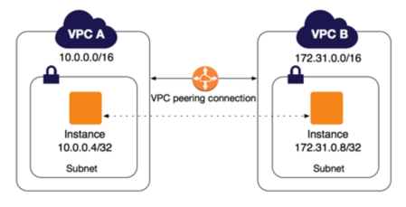
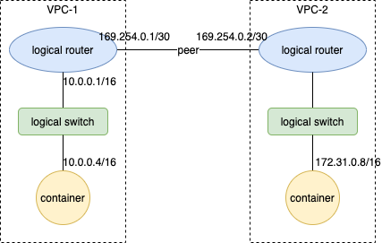

# VPC peering connection
## What is VPC peering?
A VPC peering connection is a networking connection between two VPCs that enables you to route traffic between them using private IPv4 addresses or IPv6 addresses. Instances in either VPC can communicate with each other as if they are within the same network. 



## Corresponding OVN model



## Usage
1. Create two VPC with subnet
```yaml
kind: Vpc
apiVersion: kubeovn.io/v1
metadata:
  name: vpc-1
spec: {}
---
kind: Subnet
apiVersion: kubeovn.io/v1
metadata:
  name: net1
spec:
  vpc: vpc-1
  cidrBlock: 10.0.0.0/16
---
kind: Vpc
apiVersion: kubeovn.io/v1
metadata:
  name: vpc-2
spec: {}
---
kind: Subnet
apiVersion: kubeovn.io/v1
metadata:
  name: net2
spec:
  vpc: vpc-2
  cidrBlock: 172.31.0.0/16
```

2. Establish peer connection and configure static route between vpc-1 and vpc-2
```yaml
kind: Vpc
apiVersion: kubeovn.io/v1
metadata:
  name: vpc-1
spec: 
  vpcPeerings:
    - remoteVpc: vpc-2
      localConnectIP: 169.254.0.1/30  # The interconnection address for local vpc
  staticRoutes:
    - cidr: 172.31.0.0/16             # CIDR of remote vpc subnet
      nextHopIP: 169.254.0.2          # The interconnection address for remote vpc
      policy: policyDst
---
kind: Vpc
apiVersion: kubeovn.io/v1
metadata:
  name: vpc-1
spec:
  vpcPeerings:
    - remoteVpc: vpc-2
      localConnectIP: 169.254.0.2/30 # The interconnection address for local vpc
  staticRoutes:
    - cidr: 10.0.0.0/16              # CIDR of remote vpc subnet
      nextHopIP: 169.254.0.1         # The interconnection address for remote vpc
      policy: policyDst
```
The subnets of the two VPCs can communicate with each other now.

## Limitation
1. To avoid routing problems, the subnet CIDR of two VPCs cannot overlap.
2. The interconnection address cannot overlap with the subnet CIDR.
3. You cannot establish multiple VPC peer connections between two VPCs at the same time.
4. Currently, only custom VPCs can use this feature.